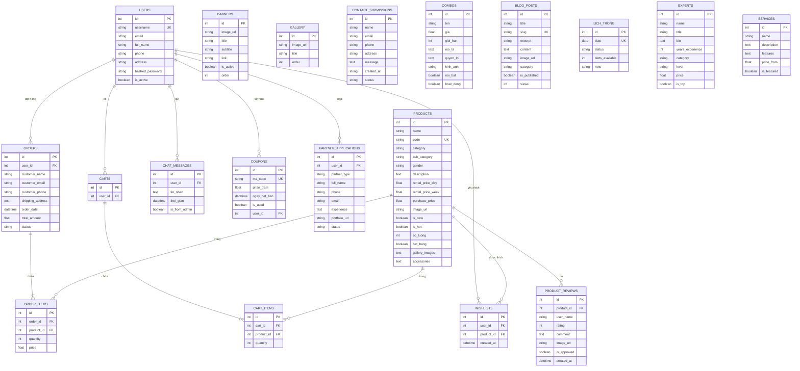
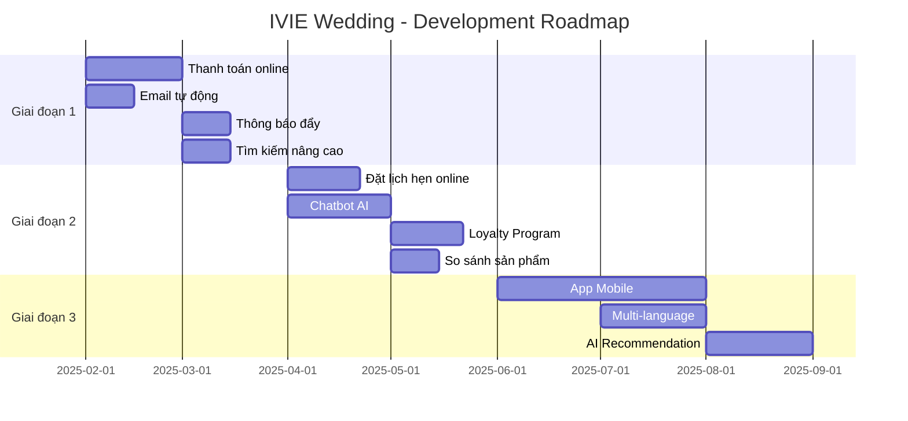

# IVIE Wedding Studio

Website cho thuê và bán váy cưới, vest, áo dài với hệ thống quản trị đầy đủ.

## Kiến trúc hệ thống

```
┌─────────────────┐     ┌─────────────────┐     ┌─────────────────┐
│    Frontend     │     │     Backend     │     │  Admin Panel    │
│   (React/Vite)  │────▶│   (FastAPI)     │◀────│  (Streamlit)    │
│   Port: 5173    │     │   Port: 8000    │     │   Port: 8501    │
└─────────────────┘     └────────┬────────┘     └─────────────────┘
                                 │
                                 ▼
                        ┌─────────────────┐
                        │   PostgreSQL    │
                        │   (Render DB)   │
                        └─────────────────┘
```

## Cấu trúc thư mục

```
ivie-wedding/
├── frontend/           # React + Vite (Khách hàng)
│   ├── src/
│   │   ├── api/        # API clients
│   │   ├── trang/      # Pages (Trang chủ, Sản phẩm, Giỏ hàng...)
│   │   ├── thanh_phan/ # Components (Header, Footer, Cards...)
│   │   └── styles/     # CSS files
│   └── .env.production
│
├── backend/            # FastAPI (API Server)
│   ├── ung_dung/
│   │   ├── chinh.py        # Main app, CORS, routes
│   │   ├── co_so_du_lieu.py # Database models (SQLAlchemy)
│   │   ├── mo_hinh.py      # Pydantic schemas
│   │   └── dinh_tuyen/     # API routes
│   │       ├── san_pham.py
│   │       ├── don_hang.py
│   │       ├── nguoi_dung.py
│   │       └── ...
│   └── requirements.txt
│
├── admin-python/       # Streamlit (Admin Panel)
│   ├── quan_tri.py     # Main admin app
│   ├── xac_thuc.py     # Authentication
│   ├── phan_tich.py    # Analytics
│   └── requirements.txt
│
└── render.yaml         # Render deployment config
```

## Database Schema

### Sơ đồ quan hệ (ER Diagram)



### Bảng chính

| Bảng | Mô tả |
|------|-------|
| `products` | Sản phẩm (váy cưới, vest, áo dài) |
| `users` | Người dùng/Khách hàng |
| `orders` | Đơn hàng |
| `order_items` | Chi tiết đơn hàng |
| `carts` | Giỏ hàng |
| `cart_items` | Chi tiết giỏ hàng |
| `banners` | Banner trang chủ |
| `gallery` | Thư viện ảnh |
| `contact_submissions` | Form liên hệ |
| `product_reviews` | Đánh giá sản phẩm |
| `combos` | Gói combo |
| `blog_posts` | Bài viết/Tin tức |
| `wishlists` | Danh sách yêu thích |
| `lich_trong` | Lịch trống (đặt lịch) |
| `chat_messages` | Tin nhắn chat |
| `coupons` | Mã giảm giá |
| `experts` | Chuyên gia trang điểm |
| `services` | Dịch vụ |
| `partner_applications` | Hồ sơ đối tác |

### Products Table

```sql
CREATE TABLE products (
    id SERIAL PRIMARY KEY,
    name VARCHAR NOT NULL,
    code VARCHAR UNIQUE NOT NULL,
    category VARCHAR NOT NULL,      -- wedding_modern, vest, aodai
    sub_category VARCHAR,           -- xoe, duoi_ca, ngan...
    gender VARCHAR NOT NULL,        -- male, female
    description TEXT,
    rental_price_day FLOAT NOT NULL,
    rental_price_week FLOAT NOT NULL,
    purchase_price FLOAT NOT NULL,
    image_url VARCHAR,
    is_new BOOLEAN DEFAULT FALSE,
    is_hot BOOLEAN DEFAULT FALSE,
    so_luong INTEGER DEFAULT 10,
    het_hang BOOLEAN DEFAULT FALSE,
    gallery_images TEXT,            -- JSON array
    accessories TEXT                -- JSON array
);
```

### Orders Table

```sql
CREATE TABLE orders (
    id SERIAL PRIMARY KEY,
    user_id INTEGER REFERENCES users(id),
    customer_name VARCHAR NOT NULL,
    customer_email VARCHAR NOT NULL,
    customer_phone VARCHAR NOT NULL,
    shipping_address TEXT NOT NULL,
    order_date TIMESTAMP DEFAULT NOW(),
    total_amount FLOAT NOT NULL,
    status VARCHAR DEFAULT 'pending'  -- pending, processing, shipped, delivered, cancelled
);
```

## API Endpoints

### Sản phẩm
- `GET /api/san_pham/` - Danh sách sản phẩm
- `GET /api/san_pham/{id}` - Chi tiết sản phẩm
- `POST /api/san_pham/` - Tạo sản phẩm (Admin)
- `PUT /api/san_pham/{id}` - Cập nhật sản phẩm (Admin)
- `DELETE /api/san_pham/{id}` - Xóa sản phẩm (Admin)

### Đơn hàng
- `GET /api/don_hang/` - Danh sách đơn hàng
- `POST /api/don_hang/` - Tạo đơn hàng
- `PUT /api/don_hang/{id}` - Cập nhật trạng thái

### Người dùng
- `POST /api/nguoi_dung/dang_ky` - Đăng ký
- `POST /api/nguoi_dung/dang_nhap` - Đăng nhập

## Deployment (Render)

### URLs Production
- Frontend: `https://ivie-wedding-final.onrender.com`
- Backend: `https://ivie-be-final.onrender.com`
- Admin: `https://ivie-ad-final.onrender.com`

### Environment Variables

**Backend:**
```
DATABASE_URL=postgresql://...
CORS_ORIGINS=https://ivie-wedding-final.onrender.com
SECRET_KEY=your_secret_key
```

**Frontend:**
```
VITE_API_BASE_URL=https://ivie-be-final.onrender.com
```

**Admin:**
```
API_BASE_URL=https://ivie-be-final.onrender.com
SECRET_KEY=your_secret_key
```

## Chạy Local

### Backend
```bash
cd backend
pip install -r requirements.txt
uvicorn ung_dung.chinh:ung_dung --reload --port 8000
```

### Frontend
```bash
cd frontend
npm install
npm run dev
```

### Admin
```bash
cd admin-python
pip install -r requirements.txt
streamlit run quan_tri.py --server.port 8501
```

## Tech Stack

| Layer | Technology |
|-------|------------|
| Frontend | React 18, Vite, React Router |
| Backend | FastAPI, SQLAlchemy, Pydantic |
| Admin | Streamlit, Pandas |
| Database | PostgreSQL (Render) |
| Hosting | Render.com |
| Image Storage | ImgBB |


## Đề xuất phát triển tương lai

### 🎯 Ưu tiên cao (Giai đoạn 1)

| Chức năng | Mô tả | Lợi ích |
|-----------|-------|---------|
| **Thanh toán online** | Tích hợp VNPay, MoMo, ZaloPay | Tăng tỷ lệ chuyển đổi, giảm thời gian xử lý |
| **Thông báo đẩy** | Push notification qua Firebase | Nhắc nhở đơn hàng, khuyến mãi |
| **Email tự động** | Xác nhận đơn, nhắc lịch hẹn | Chăm sóc khách hàng tự động |
| **Tìm kiếm nâng cao** | Filter theo size, màu, giá, ngày trống | Cải thiện UX tìm sản phẩm |

### 🚀 Ưu tiên trung bình (Giai đoạn 2)

| Chức năng | Mô tả | Lợi ích |
|-----------|-------|---------|
| **Thử váy ảo (AR)** | Dùng camera thử váy trên người | Trải nghiệm mua sắm độc đáo |
| **Chatbot AI** | Tư vấn tự động 24/7 | Giảm tải nhân viên, hỗ trợ nhanh |
| **Loyalty Program** | Tích điểm, hạng thành viên | Giữ chân khách hàng |
| **So sánh sản phẩm** | So sánh 2-3 váy cùng lúc | Hỗ trợ quyết định |
| **Đặt lịch hẹn online** | Chọn ngày giờ thử đồ | Quản lý lịch hiệu quả |

### 💡 Ưu tiên thấp (Giai đoạn 3)

| Chức năng | Mô tả | Lợi ích |
|-----------|-------|---------|
| **App Mobile** | React Native / Flutter | Tiếp cận khách hàng mobile |
| **Multi-language** | Tiếng Anh, Tiếng Trung | Mở rộng thị trường |
| **Affiliate Program** | Hoa hồng giới thiệu | Marketing lan truyền |
| **Live streaming** | Livestream giới thiệu váy | Tương tác trực tiếp |
| **AI Recommendation** | Gợi ý váy theo sở thích | Cá nhân hóa trải nghiệm |

### 🔧 Cải tiến kỹ thuật

| Hạng mục | Hiện tại | Đề xuất |
|----------|----------|---------|
| **Hosting** | Render Free (sleep 15 phút) | Render Paid / AWS / Vercel |
| **Database** | PostgreSQL Free (1GB) | PostgreSQL Paid / Supabase |
| **Image Storage** | ImgBB | Cloudinary / AWS S3 |
| **CDN** | Không có | Cloudflare |
| **Monitoring** | Không có | Sentry / LogRocket |
| **CI/CD** | Manual deploy | GitHub Actions |
| **Testing** | Không có | Jest + Pytest |
| **Caching** | Basic | Redis |

### 📊 Tính năng Analytics

```
┌─────────────────────────────────────────────────────────────┐
│                    DASHBOARD ANALYTICS                       │
├─────────────────────────────────────────────────────────────┤
│  📈 Doanh thu theo ngày/tuần/tháng                          │
│  👥 Khách hàng mới vs quay lại                              │
│  🛒 Tỷ lệ chuyển đổi giỏ hàng → đơn hàng                    │
│  👗 Sản phẩm bán chạy / ít được quan tâm                    │
│  📍 Phân bố khách hàng theo địa lý                          │
│  ⏰ Thời gian cao điểm truy cập                              │
│  💬 Phân tích feedback khách hàng                           │
└─────────────────────────────────────────────────────────────┘
```

### 🔐 Bảo mật nâng cao

- [ ] JWT Token với refresh token
- [ ] Rate limiting API
- [ ] HTTPS everywhere
- [ ] SQL injection protection (đã có qua SQLAlchemy)
- [ ] XSS protection
- [ ] CSRF protection
- [ ] 2FA cho Admin
- [ ] Audit log cho các thao tác quan trọng

### 📱 Responsive & PWA

- [ ] Progressive Web App (offline support)
- [ ] Add to Home Screen
- [ ] Push notifications
- [ ] Lazy loading images
- [ ] Skeleton loading
- [ ] Infinite scroll cho danh sách sản phẩm

---

## Roadmap



---

## Liên hệ

- Website: https://ivie-wedding-final.onrender.com
- Admin: https://ivie-ad-final.onrender.com
- API Docs: https://ivie-be-final.onrender.com/docs
